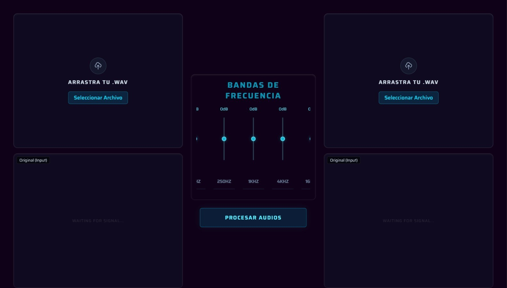

# 🎚️ Ecualizador de Audio de 5 Bandas

> Una aplicación web interactiva que permite procesar archivos de audio, aplicar filtros de frecuencia mediante FFT (Transformada Rápida de Fourier) y visualizar espectrogramas en tiempo real.

 
*(Nota: ¡Sube una captura de tu web y pon la ruta aquí!)*

## 🚀 Características

- **Procesamiento Dual:** Carga y procesa dos pistas de audio simultáneamente (Instrumental y Voz).
- **Ecualización Precisa:** Control de ganancia en 5 bandas críticas:
  - 60Hz (Sub-graves)
  - 250Hz (Graves/Cuerpo)
  - 1kHz (Medios)
  - 4kHz (Presencia)
  - 16kHz (Brillo)
- **Visualización Científica:** Generación automática de espectrogramas (mapas de calor de frecuencia vs. tiempo).
- **Interfaz Reactiva:** Diseño Cyberpunk/Neon construido con TailwindCSS.
- **Feedback Visual:** Alertas elegantes con SweetAlert2 y estados de carga.

## 🛠️ Tecnologías Utilizadas

### Frontend (Cliente)
- **Astro:** Framework principal para una web rápida y optimizada.
- **Tailwind CSS:** Estilizado moderno y responsivo.
- **JavaScript (ES6):** Lógica del cliente y manejo del DOM.
- **SweetAlert2:** Notificaciones y modales interactivos.

### Backend (Servidor)
- **Python:** Lenguaje base para el procesamiento matemático.
- **FastAPI:** API REST rápida y moderna.
- **NumPy:** Cálculos matriciales y manejo de arrays de audio.
- **SciPy:** Lectura de archivos WAV y algoritmos DSP.
- **Matplotlib:** Generación de las imágenes de los espectrogramas.

## 🧠 Cómo Funciona (La Ciencia)

El núcleo del proyecto utiliza procesamiento digital de señales (DSP):

1.  **Ingesta:** El servidor recibe el archivo `.wav` y lo normaliza a valores flotantes de 32 bits.
2.  **Transformación (FFT):** Utilizamos `rfft` de NumPy para convertir la señal del dominio del **Tiempo** al dominio de la **Frecuencia**.
3.  **Filtrado:** Se aplica una máscara multiplicativa basada en las ganancias (dB) seleccionadas por el usuario.
    - *Ejemplo: +6dB multiplica la amplitud de esa frecuencia por ~2.0.*
4.  **Reconstrucción (IFFT):** Se aplica la Transformada Inversa para recuperar el audio modificado.
5.  **Visualización:** Se genera un espectrograma logarítmico para mostrar la intensidad de las frecuencias.

## 🌐 Despliegue y Arquitectura

El proyecto utiliza una arquitectura **Client-Server** desacoplada, alojada en la nube mediante servicios modernos de PaaS (Platform as a Service).

### 🏗️ Arquitectura
* **Frontend (Cliente):** Alojado en **Vercel**. Se encarga de la interfaz de usuario, manejo de archivos y visualización.
* **Backend (Servidor):** Alojado en **Render**. Se encarga del procesamiento pesado (FFT), normalización de audio y generación de imágenes.

### 🔗 Enlaces de Producción

| Componente | Servicio | Estado | Enlace |
| :--- | :--- | :--- | :--- |
| **Frontend** | Vercel ▲ |  | [**Visitar Web App**](https://ecualizador5-bandas.vercel.app/) |
| **Backend** | Render ☁️ |  | [**Endpoint API**](https://ecualizador5bandas-backend.onrender.com/) |

### 🔄 CI/CD (Integración Continua)
El despliegue está automatizado. Ambos servicios están vinculados al repositorio de GitHub:
1.  Al hacer un `push` a la rama `main`, **Vercel** reconstruye el sitio estático y actualiza la CDN global.
2.  Simultáneamente, **Render** detecta los cambios en el código Python, reinstala las dependencias y reinicia el servidor uvicorn.

> **⚠️ Nota sobre el rendimiento:**
> Debido a las limitaciones del **Plan Gratuito de Render**, el servidor backend entra en modo de suspensión tras 15 minutos de inactividad.
>
> **La primera petición puede tardar entre 40-60 segundos** mientras la instancia se "despierta". Las peticiones subsiguientes son inmediatas.

## 👥 Integrantes del Equipo
* **Arroyo García Jairo Andrey**
* **Carmona Juárez Fátima**
* **Manrique Godínez Daniel Alejandro**
* **Ramírez García José Sebastián**
* **Rodríguez Martínez Laila Jocelyn**
